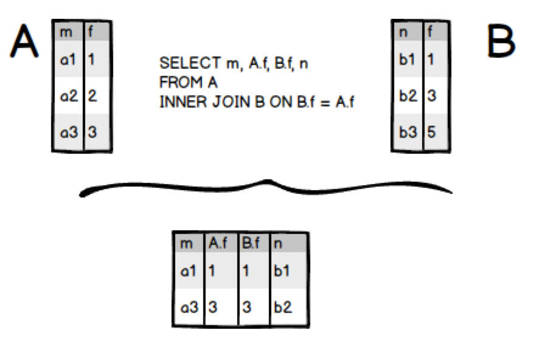
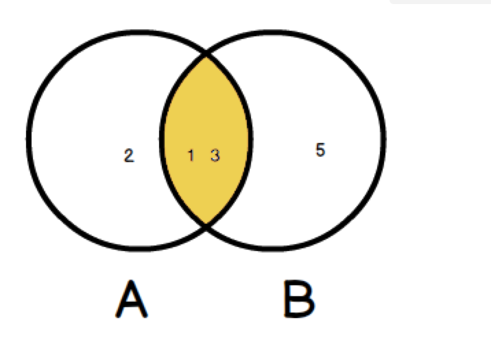
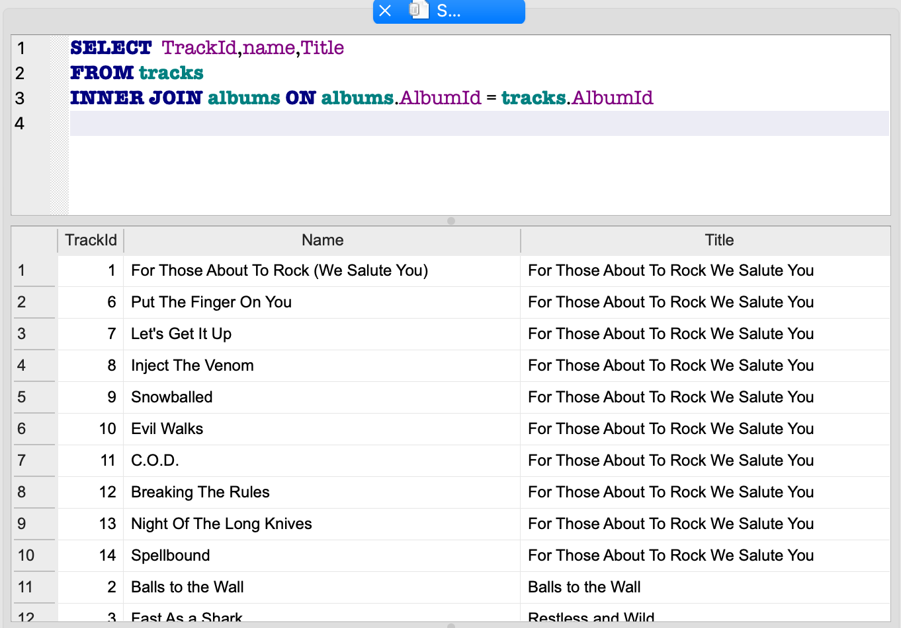
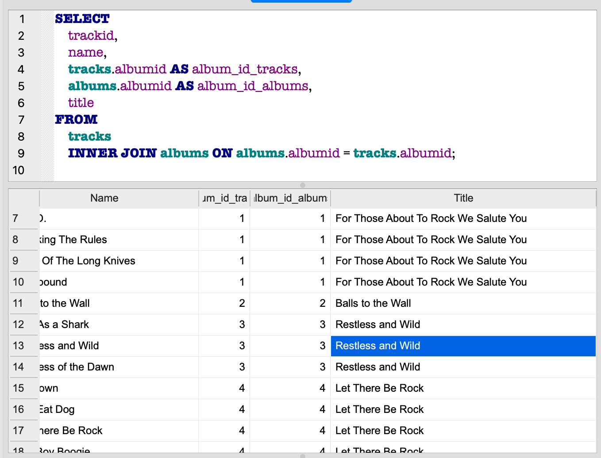
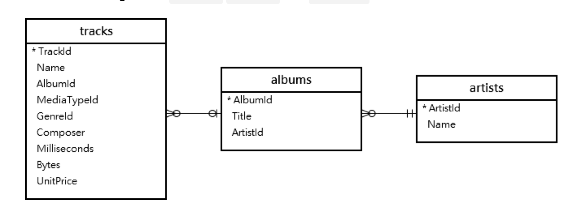
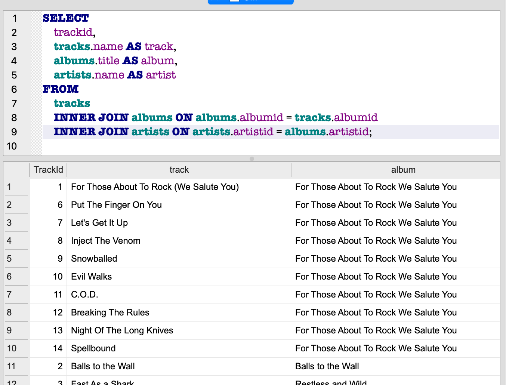

## INNER JOIN操作

- 交集的觀念





### INNER JOIN範例

- 使用chinook.db


#### 範例1

```
SELECT  TrackId,name,Title
FROM tracks
INNER JOIN albums ON albums.AlbumId = tracks.AlbumId
ORDER By TrackId
```




#### 範例2

```
SELECT
    trackid,
    name,
    tracks.albumid AS album_id_tracks,
    albums.albumid AS album_id_albums,
    title
FROM
    tracks
    INNER JOIN albums ON albums.albumid = tracks.albumid;
```



#### 範例3



```
SELECT
    trackid,
    tracks.name AS track,
    albums.title AS album,
    artists.name AS artist
FROM
    tracks
    INNER JOIN albums ON albums.albumid = tracks.albumid
    INNER JOIN artists ON artists.artistid = albums.artistid;
```



