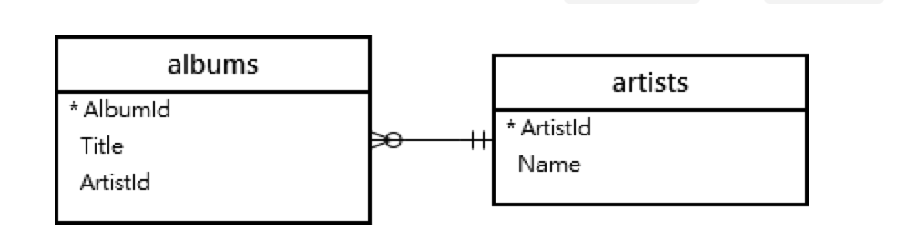
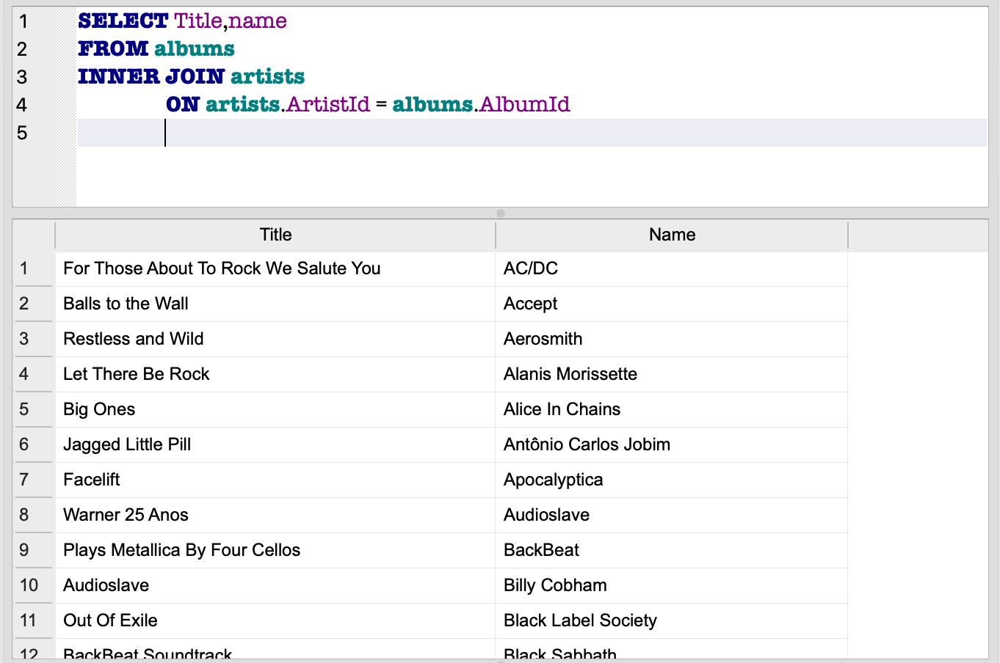

## JOIN操作

- 2個資料表的連結
- albums的ArtistId有多個
- artists的ArtistId不會重覆




### INNER JOIN範例
- 會傳回,在albums內的ArtistId有對應到albums的ArtistId的row
- 匯入albumsAndartist.sql

```
SELECT 
    Title,
    Name
FROM 
    albums
INNER JOIN artists 
    ON artists.ArtistId = albums.ArtistId;
```



### LEFT JOIN範例

- 匯入albumsAndartist.sql
- LEFT JOIN 會傳回所有artists的所有列

```
SELECT name,Title
FROM artists
LEFT JOIN albums ON
		artists.ArtistId = albums.AlbumId
ORDER BY name
```


