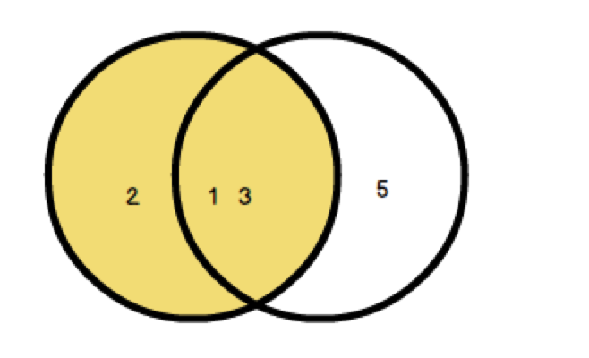
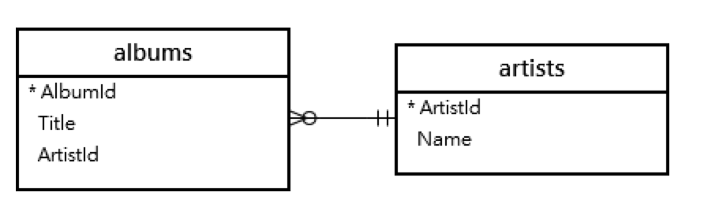
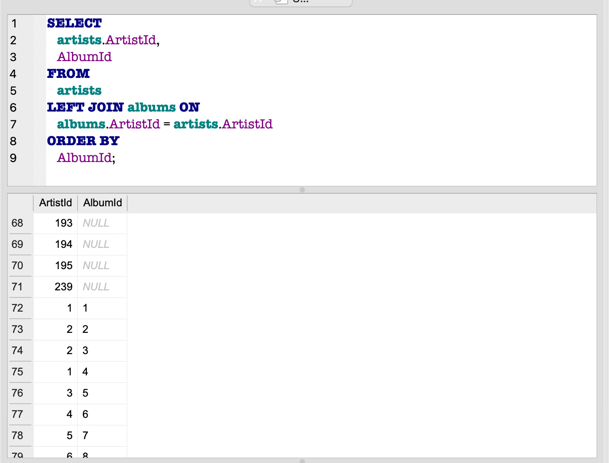

## LEFT JOIN操作

- From 後的資料表的列會全部顯示




### LEFT JOIN範例

- 匯入albumsAndartist.sql



#### 範例1

```
SELECT
   artists.ArtistId, 
   AlbumId
FROM
   artists
LEFT JOIN albums ON
   albums.ArtistId = artists.ArtistId
ORDER BY
   AlbumId;
```



#### 範例2

```
SELECT
   artists.ArtistId
   , AlbumId
FROM
   artists
LEFT JOIN albums ON
   albums.ArtistId = artists.ArtistId
WHERE
   AlbumId IS NULL;
```


