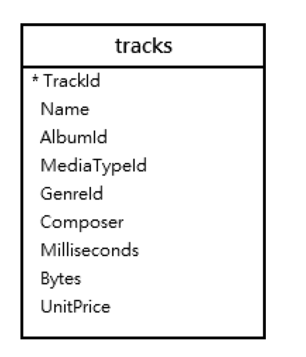

## 選取資料

### 語法:

```
SELECT [DISTINCT] column_list
FROM table_list
```

### 選取範例

- 匯入tracks.csv



### 所有欄位

```
SELECT * FROM tracks;
```

### 指定欄位

```
SELECT
	trackid,
	name,
	composer,
	unitprice
FROM
	tracks;
```


