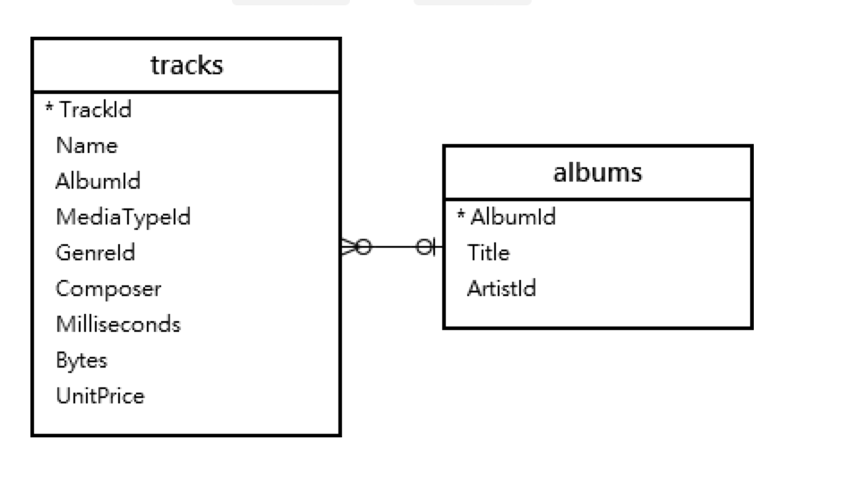
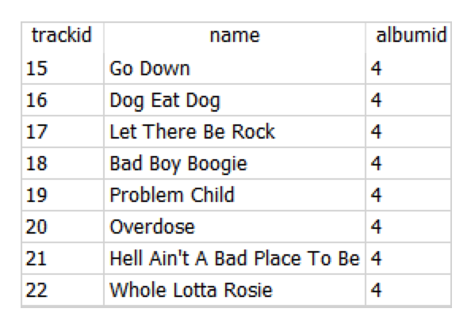
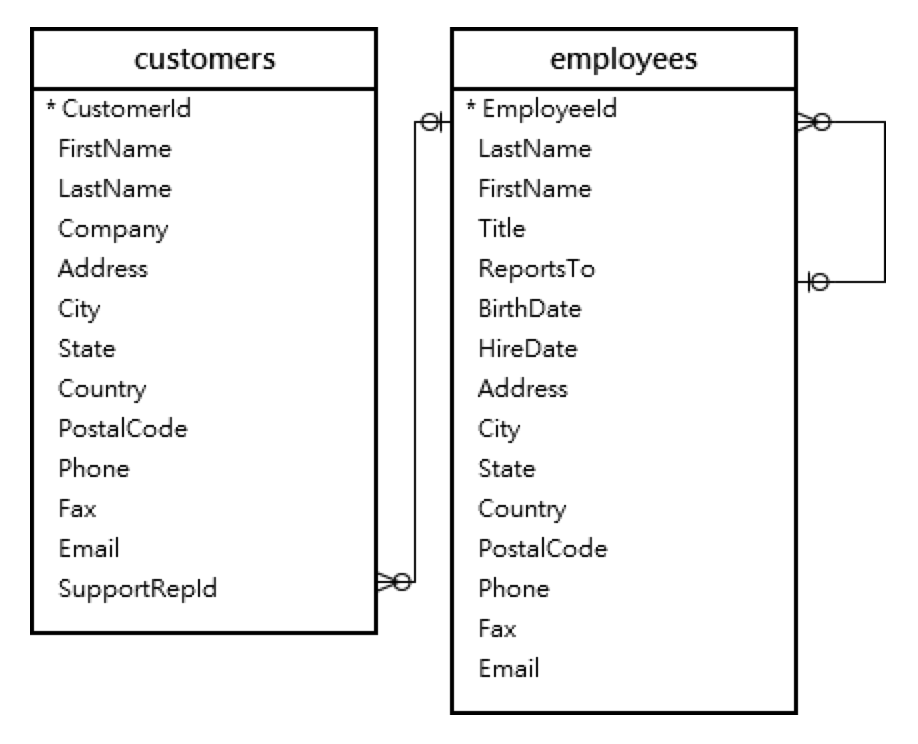
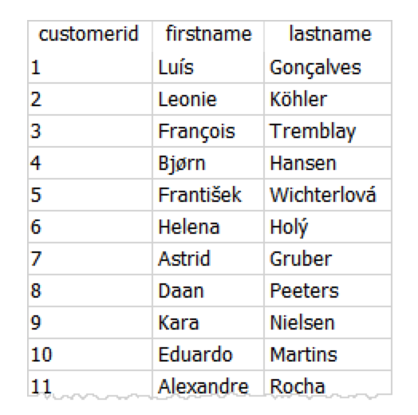

## subquery操作

### 語法
- subquery是一個SELECT的敘述
- subquery是在別的敘述內
- 別的敘述稱為外部query，subquery為內部query

```
SELECT column_1
FROM table_1
WHERE column_1 = (
   SELECT column_1 
   FROM table_2
);
```

如上: 外部query

```
SELECT column_1
  FROM table_1
 WHERE colum_1 =
```

如上:內部query

```
(SELECT column_1
  FROM table_2)
```

- subquery必需使用()符號
- subquery可以只傳回一個row值
- subquery也可以傳回多個值,可使用於類似IN的語法
- subquery可以使用在SELECT, FROM, WhERE, JOIN 敘述內


### subquery

#### subquery使用在WHERE-範例1

- 搜尋專輯歌區(albumid)內的title為'Let There Be Rock'的歌區資訊 


- 先取得albums資料表內,title為'Let There Be Rock'的albumid
- 再從tracks資料表內, 搜尋albumid的內容

```
SELECT trackid,
       name,
       albumid
FROM tracks
WHERE albumid = (
   SELECT albumid
   FROM albums
   WHERE title = 'Let There Be Rock'
);
```



#### subquery使用在WHERE-範例2

- 搜尋加拿大(Canada)員工，所服務的客戶



```
SELECT customerid,
       firstname,
       lastname
FROM customers
WHERE supportrepid IN (
           SELECT employeeid
             FROM employees
            WHERE country = 'Canada'
       );
```

