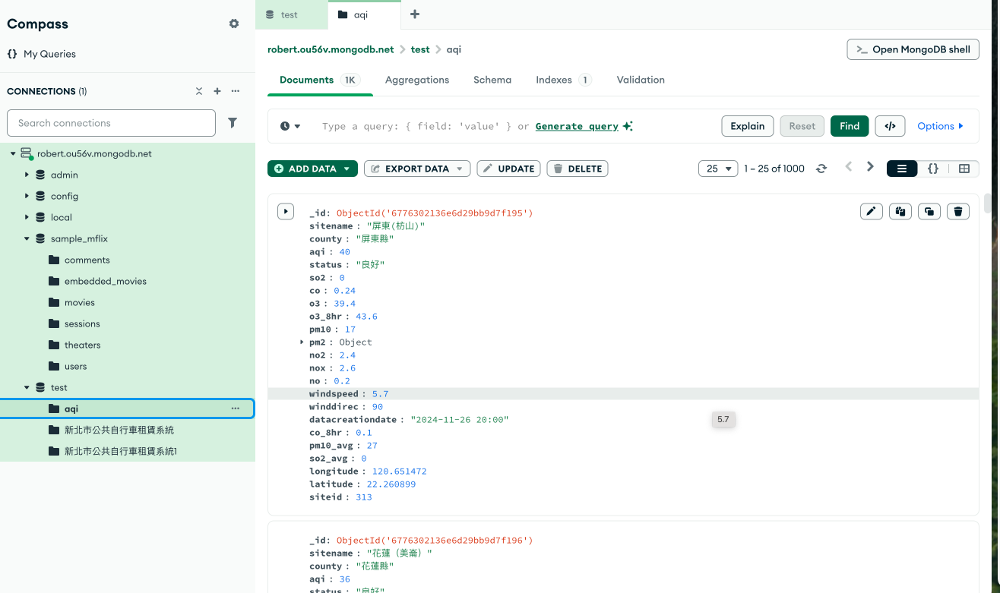

## 匯入CSV檔

- 匯入aqi.csv

### 使用MongoDB Compass
- 建立collection
- 按下add_data



### 使用python取出csv檔

```python
import os

from dotenv import load_dotenv
from pymongo import MongoClient

# Load config from a .env file:
load_dotenv()
MONGODB_URI = os.environ['MONGODB_URI']

# Connect to your MongoDB cluster:
client = MongoClient(MONGODB_URI)

# List all the databases in the cluster:
for db_info in client.list_database_names():
   print(db_info)

db = client['test']
for item in db['aqi'].find():
    #取出每筆資料dict
    print(item)

#取出所有的資料list[dict]
list(db['aqi'].find())
```


