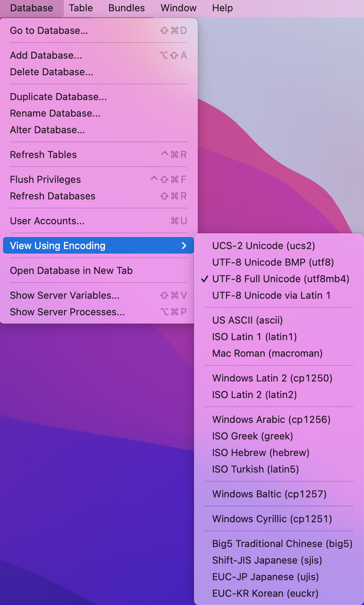

# PyMySql連線mySQLServer

## 安裝PyMySql

[安裝PyMySql](https://pypi.org/project/PyMySQL/#installation)

```
$ pip install PyMySQL
```

## 連線mySQLServer

- 使用Sequel Pro的 Database -> View UsingEncoding檢查編碼




```python
import pymysql.cursors
connection = pymysql.connect(host='localhost',
                             user='root',
                             password='12341234',
                             database='world',
                             charset='utf8mb4',                             cursorclass=pymysql.cursors.DictCursor)
with connection:
    print(connection)
    print("連線成功")
```