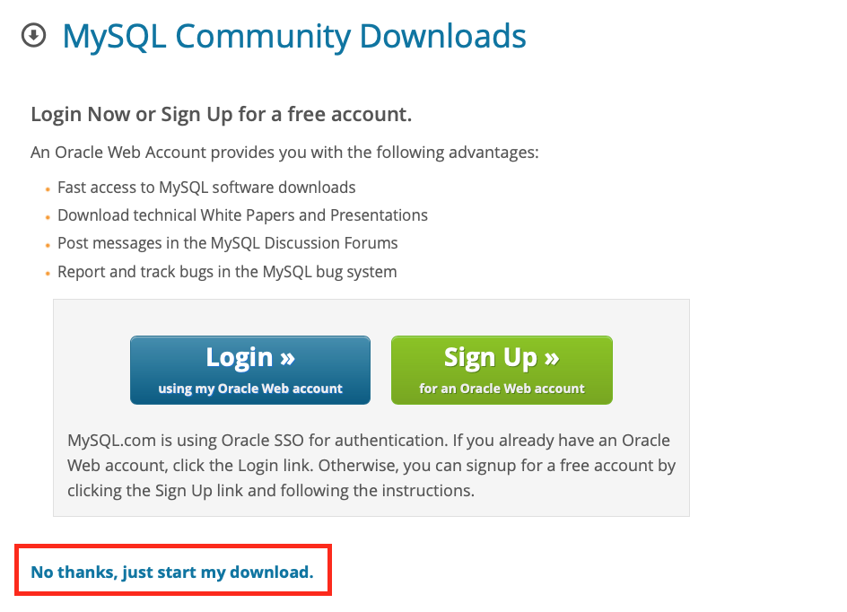
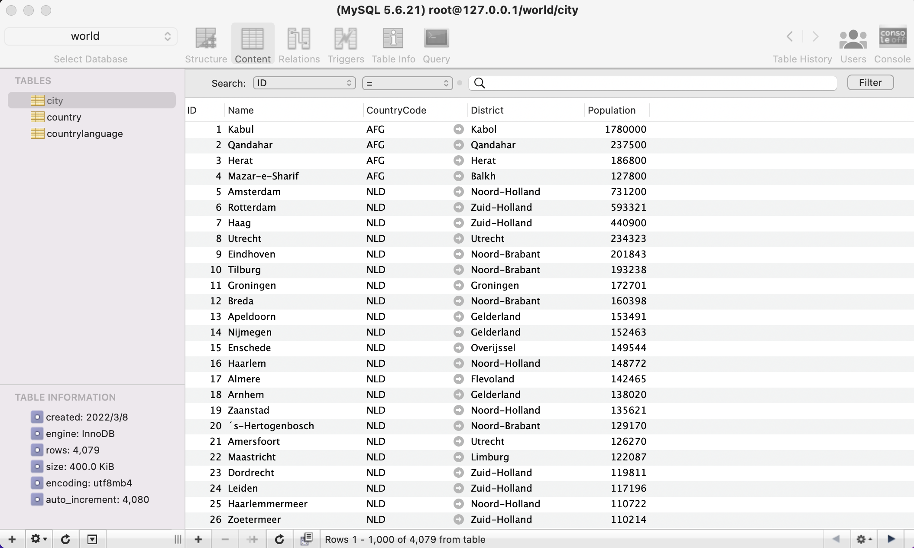

# 安裝mySQL
## mac上安裝mySQL
- [官網下載mySQL](https://dev.mysql.com/downloads/file/?id=499568), 使用下面連結下載`No thanks, just start my download.`

- 執行dmg檔,再執行pkg檔
- 使用傳統密碼加密

- 安裝完成後至 `系統偏號設定>MySQL` 點選MySQL

- 在終端機介面執行 `nano ~/.zshrc`
- 在檔案最下方新增`export PATH="/usr/local/mysql/bin:$PATH"`
- 儲存後回到終端機
- 在終端機介面執行 `source ~/.zshrc`
- 在終端機下執行 `mysql -u root -p`
- 輸入root的密碼

## mac安裝mySQL管理軟體Sequel Pro

 - [下載網址](https://www.sequelpro.com)
 
## 下載sample檔word.sql

- [官網下載 word.zip](https://dev.mysql.com/doc/index-other.html)

## 使用Sequel Pro匯入world.sql

- 使用 File -> import

