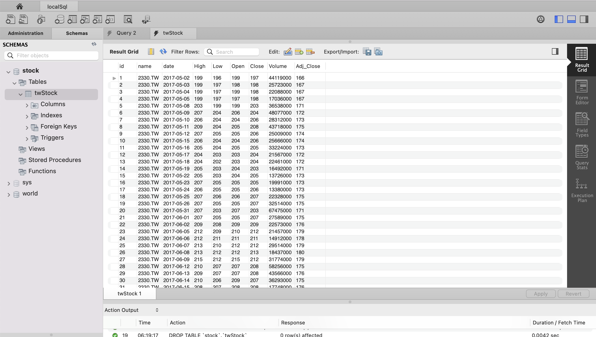

# 1下載和儲存資料



```
$ pip install pandas-datareader
```

### 主程式.py

```python
import dataSource

if __name__ == "__main__":
    try:
        dataSource.download_to_mysql('2330.TW')
    except Exception as e:
        print(e)
```

### dataSource.py

```python
import pandas_datareader.data as web
import pymysql.cursors
from datetime import datetime

from pymysql import Error

def __timestampToString(timestamp):
    #是pandas內的Timestamp
    date_time = datetime(year=timestamp.year,month=timestamp.month,day=timestamp.day)
    return date_time.strftime('%Y-%m-%d')

def __downloadData(stockName):
    try:
        df = web.get_data_yahoo(stockName)
    except:
        print('沒有資料')
        return None
    #row['Adj Close']的值,float,太長,轉int
    stockDatas = [(stockName,__timestampToString(index),row["High"],row["Low"],row["Open"],row["Close"],row["Volume"],int(row['Adj Close'])) for index, row in df.iterrows()]
    return stockDatas

def __create_connection():
    connection = None
    try:
        connection = pymysql.connect(host='localhost',
                                     user='root',
                                     password='12341234',
                                     database='stock',
                                     charset='utf8mb4',
                                     cursorclass=pymysql.cursors.DictCursor)
    except Error as e:
        print(e)
        return None
    return connection

def __create_table(conn):
    #有unique, name和date不可以使用TEXT,必需使用varchar(100),不可以超過255
    sql = '''
    CREATE TABLE IF NOT EXISTS twStock(
    		id INTEGER PRIMARY KEY AUTO_INCREMENT,
    		name VARCHAR(100),
    		date VARCHAR(100),
    		High INTEGER,
    		Low INTEGER,
    		Open INTEGER,
    		Close INTEGER,
    		Volume INTEGER,
    		Adj_Close INTEGER,
    		UNIQUE(name,date)
    );
    '''
    with conn.cursor() as cursor:
        cursor.execute(sql)
    conn.commit()

def __insert_project(conn,datas):
    #data是list內有tuple
    sql = ''' 
    REPLACE INTO twStock(name,date,High,Low,Open,Close,Volume,Adj_Close)
    VALUES(%s, %s, %s, %s, %s, %s, %s, %s)
    '''
    with conn.cursor() as cursor:
        for info in datas:
            cursor.execute(sql, info)
    conn.commit()

def download_to_mysql(stockName):
    stockDatas = __downloadData(stockName)
    conn = __create_connection()
    success = False
    if stockDatas is None or conn is None: #檢查下載和連線
        raise Exception('內部錯誤')

    with conn:
        __create_table(conn)
        __insert_project(conn, stockDatas)

```

