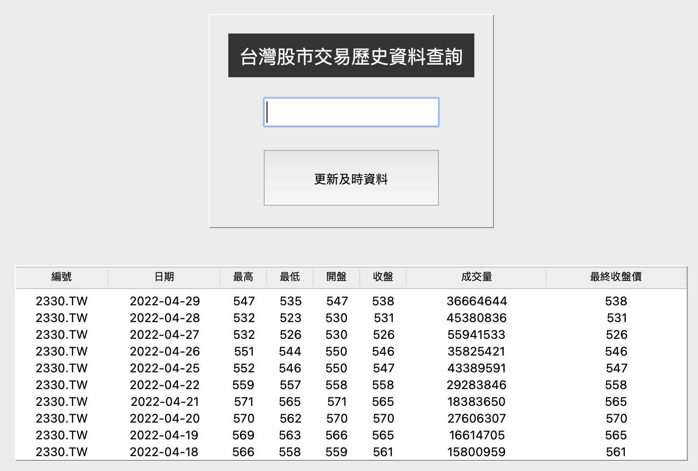

# 介面和資料整合



### 主程式.py

```python
import dataSource
import tkinter as tk
from tkinter import ttk

class Window(tk.Tk):
    def __init__(self):
        super().__init__()
        # topFrame ========== 開始
        topFrame = tk.Frame(self, relief=tk.GROOVE, borderwidth=1, width=300, height=200)
        tk.Label(topFrame, text="台灣股市交易歷史資料查詢", font=("arial", 20), bg="#333333", fg='#ffffff', padx=10, pady=10).pack(
            pady=20,padx=20)
        self.entryContent = tk.StringVar(value='請輸入股票編號')  # 控制使用者輸入內容的實體
        entry = tk.Entry(topFrame, textvariable=self.entryContent, font=("arial", 20), fg='#999999',width=15)
        entry.pack()

        def doSomeThing(event):
            #清空資料
            self.entryContent.set("")

        entry.bind('<FocusIn>', doSomeThing)

        def update_button_click():
            name = self.entryContent.get()
            if name == "":
                return

            stockName = name + ".TW"
            self.entryContent.set("")
            try:
                dataSource.download_to_mysql(stockName)
            except Exception as e:
                print(e)
                return

            #選取資料
            datas = dataSource.selected_datas(stockName)
            self.display_treeView(datas)


        tk.Button(topFrame, text="更新及時資料", padx=40, pady=20,command=update_button_click).pack(pady=20)
        topFrame.pack(padx=20, pady=20)
        # topFrame ========== 結束

        #bottomFrame ==========開始
        bottomFrame = tk.Frame(self, relief=tk.GROOVE, borderwidth=1, width=300, height=200)
        self.tree = ttk.Treeview(bottomFrame, columns=('name','date', 'hight', 'low', 'open', 'close','volume','adj_close'), show='headings')
        self.tree.heading('name',text="編號")
        self.tree.heading('date',text='日期')
        self.tree.heading('hight',text='最高')
        self.tree.heading('low', text='最低')
        self.tree.heading('open', text='開盤')
        self.tree.heading('close',text= '收盤')
        self.tree.heading('volume', text='成交量')
        self.tree.heading('adj_close', text='最終收盤價')
        self.tree.column('name',width=100,anchor=tk.CENTER)
        self.tree.column('date', width=120,anchor=tk.CENTER)
        self.tree.column('hight', width=50,anchor=tk.CENTER)
        self.tree.column('low', width=50,anchor=tk.CENTER)
        self.tree.column('open', width=50,anchor=tk.CENTER)
        self.tree.column('close', width=50,anchor=tk.CENTER)
        self.tree.column('volume', width=150,anchor=tk.CENTER)
        self.tree.column('adj_close', width=150,anchor=tk.CENTER)
        self.tree.pack(side=tk.TOP)
        bottomFrame.pack(padx=20, pady=20)
        #bottomFrame ==========結束


    def display_treeView(self,datas):
        #清除tree內容
        for i in self.tree.get_children():
            self.tree.delete(i)

        for info in datas:
            stockInfo = (info['name'],info['date'],info['High'],info['Low'],info['Open'],info['Close'],info['Volume'],info['Adj_Close'])
            self.tree.insert('',tk.END,values=stockInfo)

if __name__ == "__main__":
    #視窗介面
    window = Window()
    window.resizable(0, 0) #無法改變視窗大小
    window.geometry("+300+300")
    window.title("台灣股市交易歷史資料查詢")
    window.mainloop()
```

### dataSource.py

```python
import pandas_datareader.data as web
import pymysql.cursors
from pymysql import Error
from datetime import datetime

def __timestampToString(timestamp):
    #是pandas內的Timestamp
    date_time = datetime(year=timestamp.year,month=timestamp.month,day=timestamp.day)
    return date_time.strftime('%Y-%m-%d')

def __downloadData(stockName):
    try:
        df = web.get_data_yahoo(stockName)
    except:
        print('沒有資料')
        return None
    #row['Adj Close']的值,float,太長,轉int
    stockDatas = [(stockName,__timestampToString(index),row["High"],row["Low"],row["Open"],row["Close"],row["Volume"],int(row['Adj Close'])) for index, row in df.iterrows()]
    return stockDatas

def __create_connection():
    connection = None
    try:
        connection = pymysql.connect(host='localhost',
                                     user='root',
                                     password='12341234',
                                     database='stock',
                                     charset='utf8mb4',
                                     cursorclass=pymysql.cursors.DictCursor)
    except Error as e:
        print(e)
        return None
    return connection

def __create_table(conn):
    #有unique, name和date不可以使用TEXT,必需使用varchar(100),不可以超過255
    sql = '''
    CREATE TABLE IF NOT EXISTS twStock(
    		id INTEGER PRIMARY KEY AUTO_INCREMENT,
    		name VARCHAR(100),
    		date VARCHAR(100),
    		High INTEGER,
    		Low INTEGER,
    		Open INTEGER,
    		Close INTEGER,
    		Volume INTEGER,
    		Adj_Close INTEGER,
    		UNIQUE(name,date)
    );
    '''
    with conn.cursor() as cursor:
        cursor.execute(sql)
    conn.commit()

def __insert_project(conn,datas):
    #data是list內有tuple
    sql = ''' 
    REPLACE INTO twStock(name,date,High,Low,Open,Close,Volume,Adj_Close)
    VALUES(%s, %s, %s, %s, %s, %s, %s, %s)
    '''
    with conn.cursor() as cursor:
        for info in datas:
            cursor.execute(sql, info)
    conn.commit()

def selected_datas(stockName):
    sql = '''
    SELECT *
    From twStock
    WHERE name = %s
    ORDER BY date DESC;
    '''
    conn = __create_connection()
    if conn is not None:
        with conn:
            with conn.cursor() as cursor:
                cursor.execute(sql,(stockName,))
                datas = cursor.fetchall()
        return datas

def download_to_mysql(stockName):
    stockDatas = __downloadData(stockName)
    conn = __create_connection()
    if stockDatas is None or conn is None: #檢查下載和連線
        raise Exception('內部錯誤')

    with conn:
        __create_table(conn)
        __insert_project(conn, stockDatas)

def selected_datas(stockName):
    sql = '''
    SELECT *
    From twStock
    WHERE name = %s
    ORDER BY date DESC;
    '''
    conn = __create_connection()
    if conn is not None:
        with conn:
            with conn.cursor() as cursor:
                cursor.execute(sql,(stockName,))
                datas = cursor.fetchall()
        return datas
```

