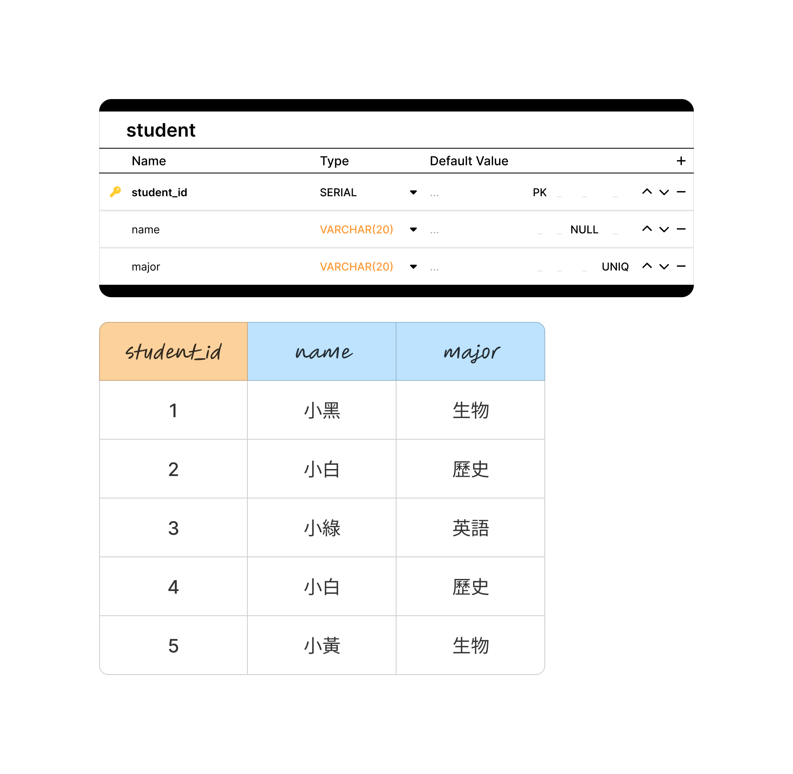

## postgre的基本資料類型

- 字串 
	- VARCHAR -> 沒有限定長度
	- VARCHAR(n) -> 有長度限制
	- TEXT -> 沒有限定長度(多文字)

- 整數數值
	- SMALLINT -> 2byte(-32,768 to 32.767) 
	- INT -> 4byte(-2,147,483,648 to 2,147,483,647)
	- BIGINT -> 8byte(9,223,372,036,854,775,808 to +9,223,372,036,854,775,807)
	- SERIAL -> (SERIAL可以自動有的AUTOINCREMENT功能)

- 浮點數型別 
	- real和float8 -> 4byte 
	- float(n) -> 8byte,n為小數點後n個以內
	- numeric(p,s) -> p為整數和小數的總合,s為小數點後可以有多少

- 時間型別
	- DATE - 日期
	- TIME - 時間
	- TIMESTAMP - 日期時間

- Boolean
	- boolean或bool
	- true的值可以是 1,yes,y,true,t
	- false的值可以是 0,no,false,f

