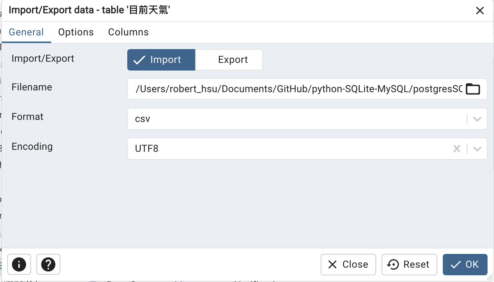
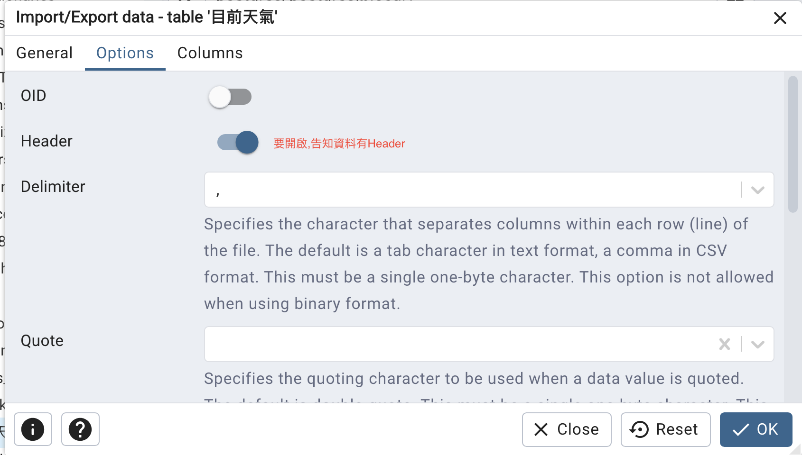

## 1. 匯入CSV - 使用sqlite建立的城市.sql
- 將(城市.csv)透過DB browser匯入
- 透過DB browser匯出(城市.sql)
- [城市.sql檔案下載](./其它範例csv/city.sql)
- 使用pdAdmin4開啟城市.sql,並執行城市.sql

## 2. 匯入目前天氣.CSV

- [目前天氣.csv下載](./其它範例csv/目前天氣.csv)
- 建立目前天氣資料表,如下面SQL:

```sql
/*建立資料表*/
CREATE TABLE IF NOT EXISTS 目前天氣(
	城市 VARCHAR(10),
	啟始時間 DATE,
	結束時間 DATE,
	最高溫度 REAL,
	最低溫度 REAL,
	感覺 VARCHAR,
	PRIMARY KEY(城市)
);
```

- 使用pdAdmin匯入目前天氣.csv至資料表目前天氣






## 3. 匯入台鐵車站資訊和車站進出資料
- [台鐵車站資訊.csv](https://github.com/roberthsu2003/python-SQLite-MySQL/blob/master/postgresSQL/範例資料庫/其它範例csv/台鐵車站資訊.csv)

- [2019,2020,2021,2022,2023進出資訊](https://github.com/roberthsu2003/python-SQLite-MySQL/blob/master/postgresSQL/範例資料庫/其它範例csv/每日各站進出站人數20190423-20231231.zip
)

```sql
CREATE TABLE IF NOT EXISTS stations(
	id Serial PRIMARY KEY,
	stationCode VARCHAR(5),
	stationName VARCHAR(20) NOT NULL,
	name VARCHAR(20),
	stationAddrTw VARCHAR(50),
	stationTel VARCHAR(20),
	gps VARCHAR(30),
	haveBike BOOLEAN
);

DROP TABLE IF EXISTS stations;

SELECT *
FROM stations;

CREATE TABLE IF NOT EXISTS station_in_out(
	date TIMESTAMP,
	staCode VARCHAR(5) NOT NULL,
	gateInComingCnt INTEGER,
	gateOutGoingCnt INTEGER,
	PRIMARY KEY (date,staCode)
);

DROP TABLE IF EXISTS station_in_out; 
```

## 4. 匯入DVD租賃店專案資料庫

### DVD Rental DataBase資料架構


### 下載DVD Rental Database(postgreSQL)
- [下載位址](./dvd_rental_database/)
- 解壓縮後會產生一個dvdrental的資料夾
- 使用pgadmin4
- 建立一個dvdrental的資料庫
- restore(注意是資料夾)如下圖


> 出處:https://www.postgresqltutorial.com/postgresql-getting-started/postgresql-sample-database/


