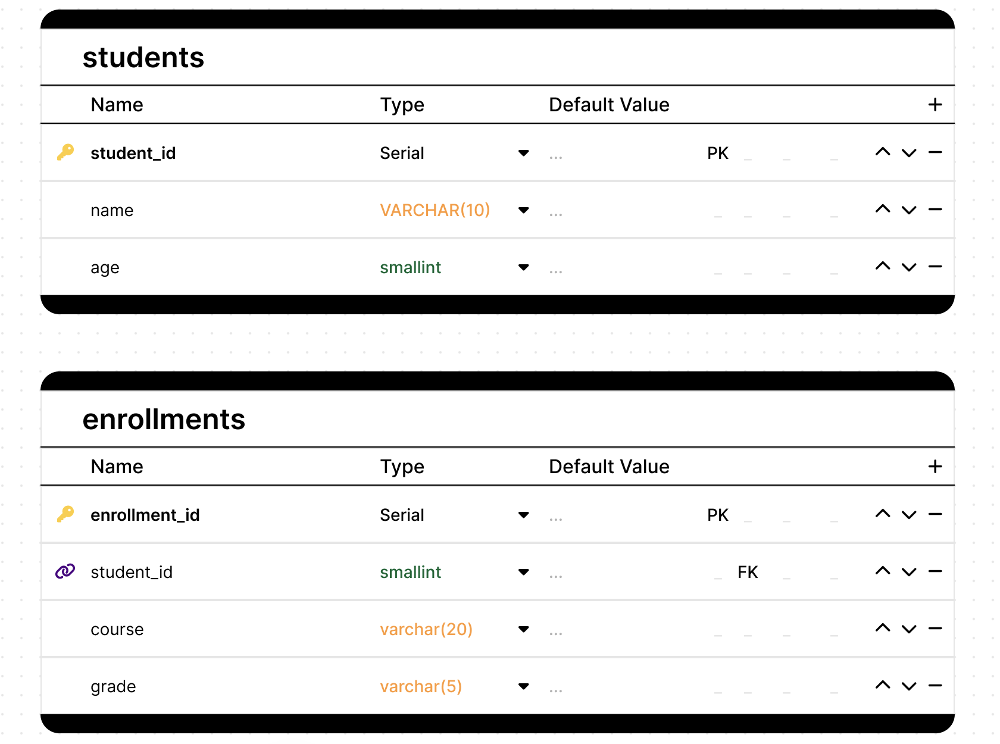
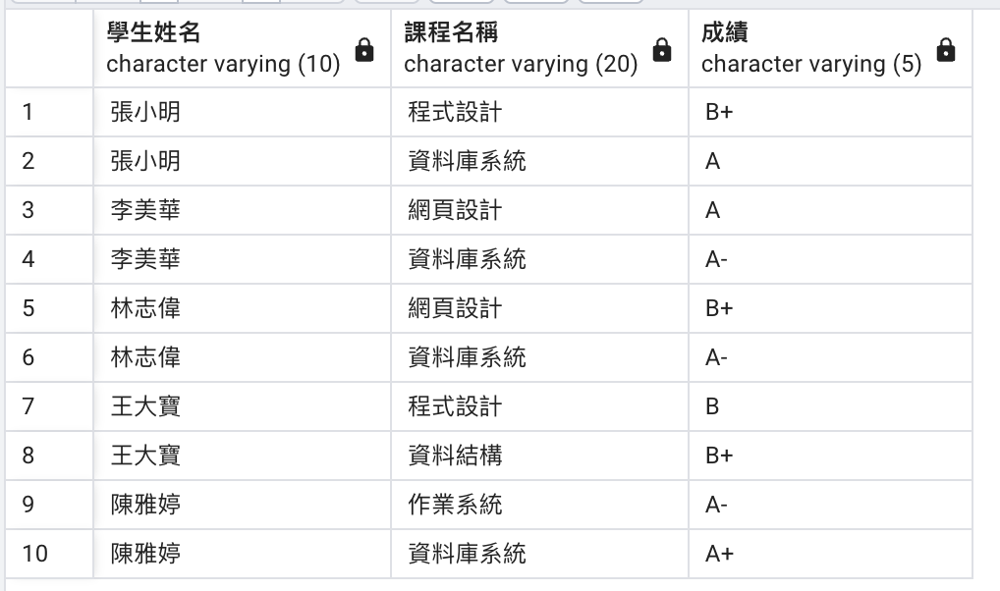

## 適合初學者關聯資料庫
- 學生students
- 註冊上課的課目enrollments



### 建立資料表

```sql
-- Create Tables
CREATE TABLE students (
    student_id SERIAL PRIMARY KEY,
    name VARCHAR(10),
    age smallint
);

CREATE TABLE enrollments (
    enrollment_id SERIAL PRIMARY KEY,
    student_id smallint REFERENCES students(student_id),
    course_name VARCHAR(20),
    grade VARCHAR(5)
);

```

### 資料表加入資料

```sql
-- Insert data into students table
INSERT INTO students (name, age) VALUES
    ('張小明', 20),
    ('李美華', 19),
    ('王大寶', 21),
    ('陳雅婷', 20),
    ('林志偉', 22);

-- Insert data into enrollments table
INSERT INTO enrollments (student_id, course_name, grade) VALUES
    (1, '資料庫系統', 'A'),
    (1, '程式設計', 'B+'),
    (2, '資料庫系統', 'A-'),
    (2, '網頁設計', 'A'),
    (3, '程式設計', 'B'),
    (3, '資料結構', 'B+'),
    (4, '資料庫系統', 'A+'),
    (4, '作業系統', 'A-'),
    (5, '網頁設計', 'B+'),
    (5, '資料庫系統', 'A-');
```

### 使用join顯示所有資料

```sql
SELECT 
    s.name AS 學生姓名,
    e.course_name AS 課程名稱,
    e.grade AS 成績
FROM students s
JOIN enrollments e ON s.student_id = e.student_id
ORDER BY s.name, e.course_name;
```

#### 結果



