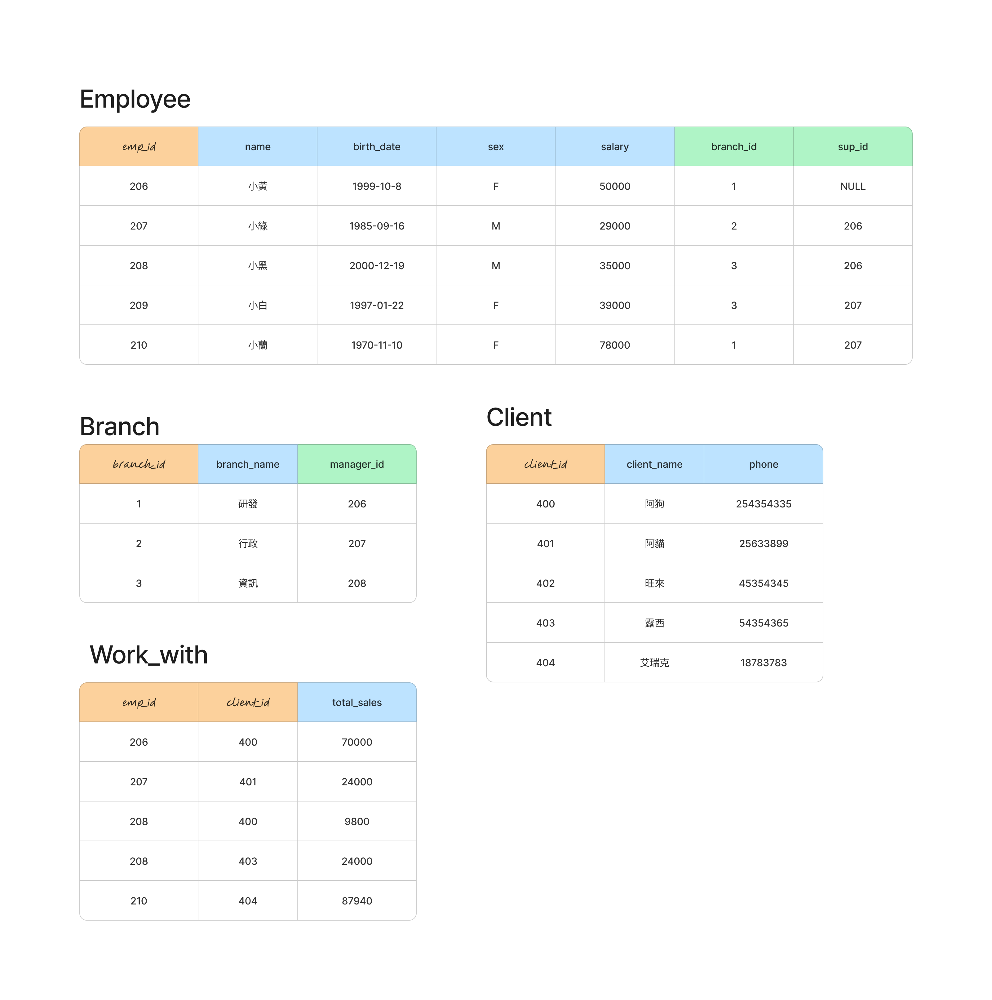

## 建立關聯資料庫

### 語法

```sql
FOREIGN KEY(fk_columns) 
REFERENCES parent_table(parent_key_columns)
[ON DELETE delete_action]
[ON UPDATE update_action]
```

### action 支援語法

- SET NULL
- SET DEFAULT
- RESTRICT
- NO ACTION
- CASCADE



### 創建公司資料庫

```sql
DROP TABLE IF EXISTS employee CASCADE;
DROP TABLE IF EXISTS  branch CASCADE;
DROP TABLE IF EXISTS client  CASCADE;
DROP TABLE IF EXISTS works_with CASCADE;
```

#### 創立員工表格

```
CREATE TABLE employee(
	emp_id SERIAL,
	name VARCHAR(20),
	birth_date DATE,
	sex VARCHAR(1),
	salary INT,
	branch_id INT,
	sup_id INT,
 	PRIMARY KEY(emp_id)
);
```

> [參考語法foreign key](https://www.postgresqltutorial.com/postgresql-tutorial/postgresql-foreign-key*/)

#### 創立部門表格

```sql
CREATE TABLE branch(
	branch_id INT,
	branch_name VARCHAR(20),
	manager_id INT,
	PRIMARY KEY(branch_id),
	FOREIGN KEY(manager_id)
	REFERENCES employee(emp_id) ON DELETE SET NULL
);
```

#### 補上employee少設的2個Foreign key

```sql
ALTER TABLE employee
ADD FOREIGN KEY(branch_id) REFERENCES branch(branch_id) ON DELETE SET NULL;

ALTER TABLE employee
ADD FOREIGN KEY(sup_id)
REFERENCES employee(emp_id)
ON DELETE SET NULL;
```

#### 創建客戶表格

```sql
CREATE TABLE client(
	client_id SERIAL,
	client_name VARCHAR(20),
	phone VARCHAR(20),
	PRIMARY KEY(client_id)
);
```


#### 創建works_with表格

```sql
CREATE TABLE works_with(
	emp_id INT,
	client_id INT,
	total_sales INT,
	PRIMARY KEY(emp_id,client_id),
	FOREIGN KEY(emp_id) REFERENCES employee(emp_id) ON DELETE CASCADE,
	FOREIGN KEY(client_id) REFERENCES client(client_id) ON DELETE CASCADE
);
```
