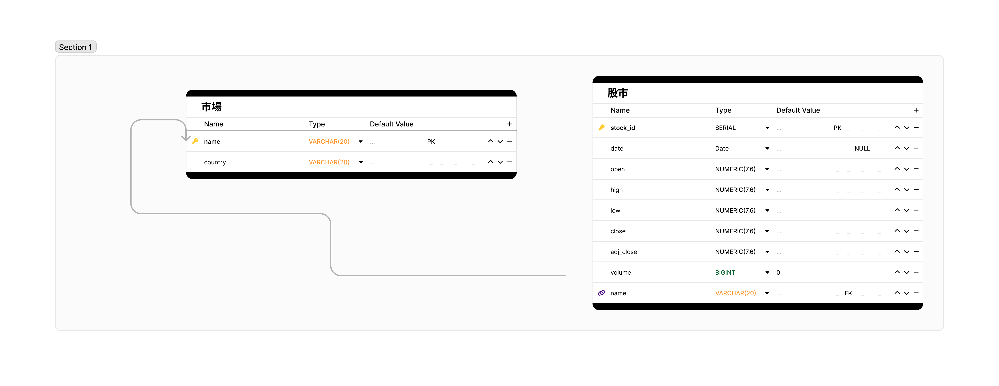

## 下載大盤股市

### requirements.txt

```
psycopg2
pandas
pandas-datareader
Pyarrow
yfinance
streamlit
```


### 資料結構(股市.jam)




### sql

1. [資料庫建立](./1資料庫建立.sql)
2. [資料表建立](./2資料表建立.sql)
3. [新增資料](./3新增資料.sql)
4. [取出資料](./4取出資料.sql)

### ipynb

1. [lesson1_資料下載](./lesson1_資料下載.ipynb)
2. [lesson2_建立資料表](./lesson2_建立資料表.ipynb)
3. [lesson3_新增資料](./lesson3_新增資料.ipynb)
4. [lesson4_取出資料](./lesson4_取出資料.ipynb)

### main.py(只有股市)
[main.py](./main.py)


### main1.py(股市和日期範圍)
[main1.py](./main1.py)


