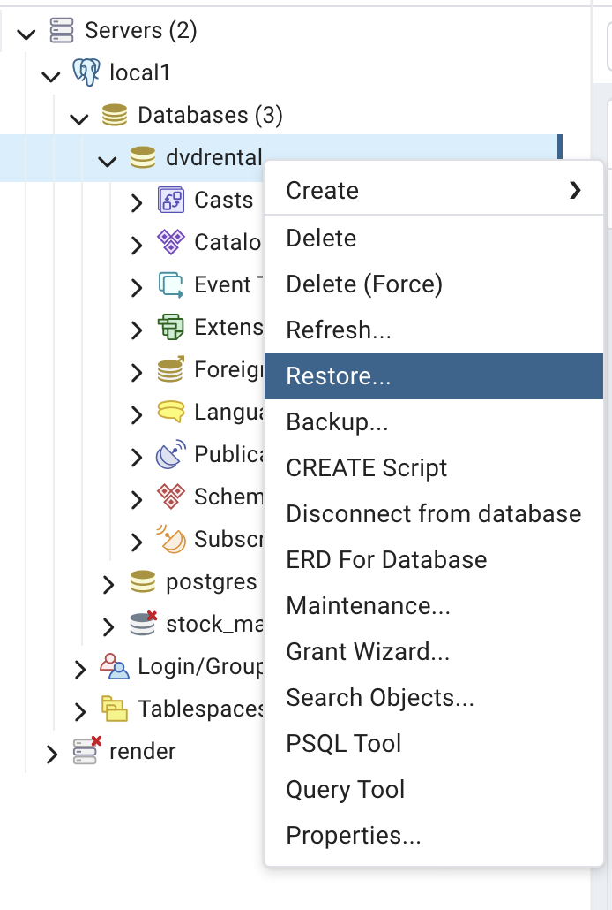
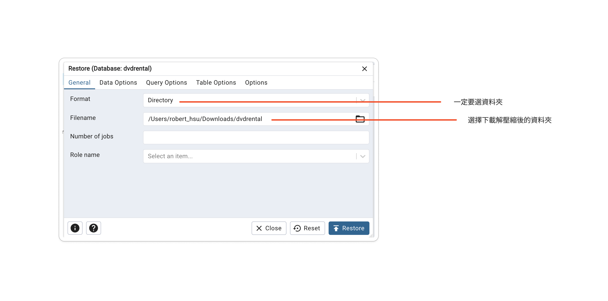

# 範例資料庫

## DVD Rental DataBase(DVD出租資料庫)

### DVD Rental DataBase資料架構

### 下載DVD Rental Database(postgreSQL)
- [下載位址](./dvd_rental_database/)
- 解壓縮後會產生一個dvdrental的資料夾
- 使用pgadmin4
- 建立一個dvdrental的資料庫
- restore(注意是資料夾)如下圖

> 出處:https://www.postgresqltutorial.com/postgresql-getting-started/postgresql-sample-database/

## 其它範例csv檔

- [其它範例csv下載位址](./其它範例csv)