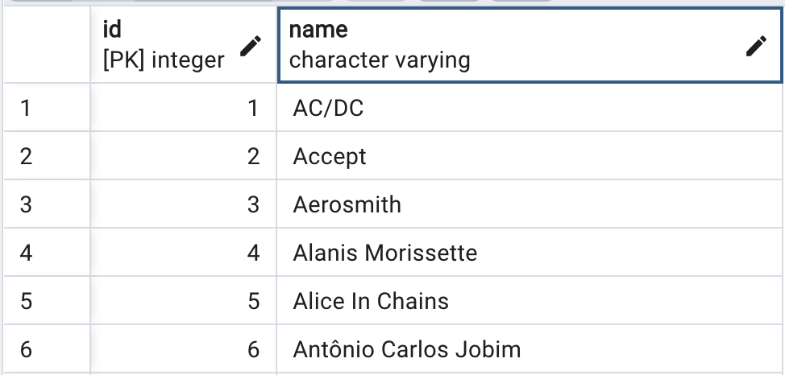
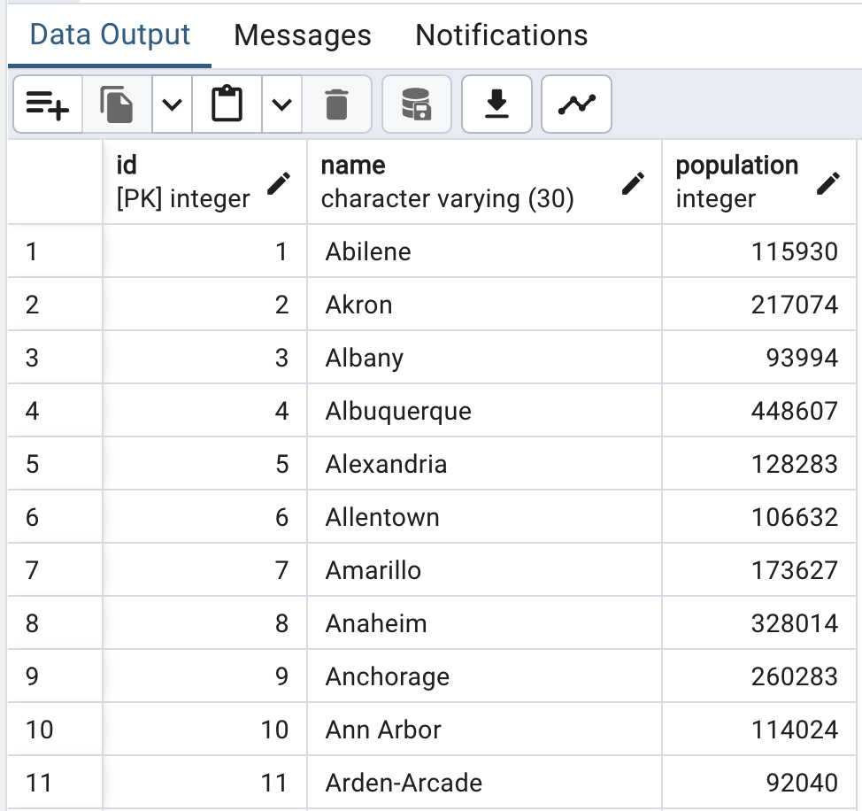
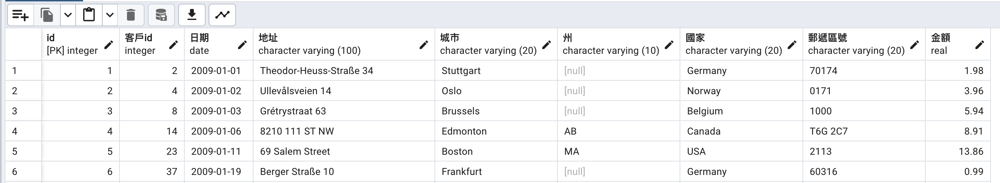
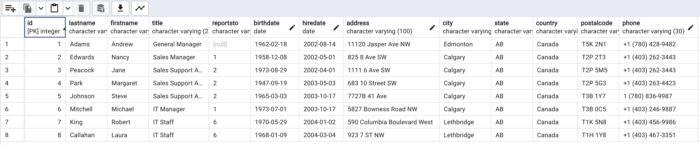

## 練習建立資料表

- 使用city.csv檔
- 使用employees.csv檔
- 使用invoices.csv檔
- 使用artists.csv檔

### 建立artists
- 匯入artists.csv檔
- 欄位名稱改為id,name

```sql
CREATE TABLE IF NOT EXISTS artists(
	id SERIAL PRIMARY KEY,
	name VARCHAR
);

```



---

###  建立city資料表
- 匯入city.csv檔
- 建立id,primary key

```sql
CREATE TABLE IF NOT EXISTS city(
	id SERIAL PRIMARY KEY,
	name VARCHAR(30),
	population INT
);
```



---

### 建立invoices資料表
- 匯入invoices.csv檔
- id,客戶,日期,地址,城市,州,國家,郵遞區號,金額

```sql
CREATE TABLE IF NOT EXISTS invoices(
	id SERIAL PRIMARY KEY,
	客戶id INT,
	日期 DATE,
	地址 VARCHAR(100),
	城市 VARCHAR(20),
	州 VARCHAR(10),
	國家 VARCHAR(20),
	郵遞區號 VARCHAR(20),
	金額 real
);
```



---

### 建立employees資料表
- 匯入invoices.csv

```sql
CREATE TABLE IF NOT EXISTS employees(
	id SERIAL PRIMARY KEY,
	lastName VARCHAR(20),
	firstName VARCHAR(20),
	title VARCHAR(20),
	reportsTo VARCHAR(20),
	birthDate DATE,
	hireDate DATE,
	address VARCHAR(100),
	city VARCHAR(20),
	state VARCHAR(20),
	country VARCHAR(20),
	postalCode VARCHAR(20),
	phone VARCHAR(30),
	fax VARCHAR(30),
	email VARCHAR(30)
);
```




