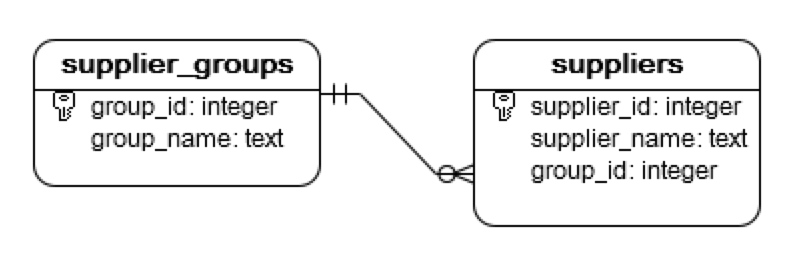

# SQL語法
## 下載sqlite GUI視覺化工具 [DB Browser for SQLite](https://sqlitebrowser.org/dl/)
## [SQLite tutorial](https://www.sqlitetutorial.net)

## 建立資料庫

```
按建立資料庫
```

---

## 建立資料表

### sqlite的資料類型

| 類型 | 說明 |
|:--|:--|
| NULL | 空的或不知道的資料 |
| INTEGER | 正整數或負整數 |
| REAL | 浮點數 |
| TEXT |  文字 |
| BLOB | binary資料，如照片或影片 |

### 語法:
#### 限制的關鍵字:
- IF NOT EXITS
- PRIMARY
- NOT NULL
- DEFAULT 
- WITHOUT ROWID
- UNIQUE

```
CREATE TABLE [IF NOT EXISTS] [schema_name].table_name (
		column_1 data_type PRIMARY KEY,
   	column_2 data_type NOT NULL,
		column_3 data_type DEFAULT 0,
		table_constraints
) [WITHOUT ROWID];
```

### 範例:

```
CREATE TABLE IF NOT EXISTS contacts (
	contact_id INTEGER PRIMARY KEY,
	first_name TEXT NOT NULL,
	last_name TEXT NOT NULL,
	email TEXT NOT NULL UNIQUE,
	phone TEXT NOT NULL UNIQUE
);
```

## 從csv匯資料至sqlite

```
將city.csv 手動匯入至資料庫內
```

---

## Date 和 Time

- sqlite沒有專門的Date和Time的資料類型
- 使用TEXT,REAL,INTEGER來取代

### 使用TEXT,要符合ISO8601格式

```
YYYY-MM-DD HH:MM:SS.SSS
```

#### 範例:

```
CREATE TABLE datetime_text(
   d1 text, 
   d2 text
);
```

使用datetime-function()

UTC日期時間 -> datetime('now')

```
SELECT　datetime('now')
```

本地日期時間 -> datetime('now','localtime')

```
SELECT datetime('now','localtime')
```

#### 範例：

```
INSERT INTO datetime_text (d1, d2)
VALUES(datetime('now'),datetime('now', 'localtime'));
```

```
SELECT
	d1,
	typeof(d1),
	d2,
	typeof(d2)
FROM
	datetime_text;
```

### 使用整數格式

- 1970-01-01 00:00:00到目前的秒數

#### 範例:

```
CREATE TABLE datetime_int (d1 int);
```

- 使用function strftime('%s','now') 
- 使用function strftime('%s','now','localtime')

```
INSERT INTO datetime_int (d1)
VALUES(strftime('%s','now'));
```

```
SELECT d1 FROM datetime_int;
```

```
SELECT datetime(d1,'unixepoch')
FROM datetime_int;
```

## PRIMARY KEY
- 整個資料表的識別欄位
- 使用PRIMARY,NOT NULL就自動產生

### 建立一個primary key語法

```
CREATE TABLE table_name(
   column_1 INTEGER NOT NULL PRIMARY KEY,
   ...
);
```

### 建立多個primary key 語法

```
CREATE TABLE table_name(
   column_1 INTEGER NOT NULL,
   column_2 INTEGER NOT NULL,
   ...
   PRIMARY KEY(column_1,column_2,...)
);
```

### rowid自動產生,語法:
- primary key 資料類型設為 INTEGER,rowid自動產生,一定只可以是(INTEGER)

```
CREATE TABLE table(
   pk INTEGER PRIMARY KEY,
   ...
);
```

### 不要rowid自動產生,語法:

- DESC

```
CREATE TABLE table(
   pk INTEGER PRIMARY KEY DESC,
   ...
);
```


### 範例:

```
CREATE TABLE countries (
   country_id INTEGER PRIMARY KEY,
   name TEXT NOT NULL
);
```

```
CREATE TABLE languages (
   language_id INTEGER,
   name TEXT NOT NULL,
   PRIMARY KEY (language_id)
);
```


---
## insert 操作


### 語法:
```
INSERT INTO table1 (column1,column2 ,..)
VALUES 
   (value1,value2 ,...),
   (value1,value2 ,...),
    ...
   (value1,value2 ,...);
```

### 新增一筆資料

- 匯入artists.csv

```
INSERT INTO artists (name)
VALUES('Bud Powell');
```

### 新增多筆資料

```
INSERT INTO artists (name)
VALUES
	("Buddy Rich"),
	("Candido"),
	("Charlie Byrd");
```

--- 

## foreign key

- 強制設定2個資料表欄位的關係

### 檢查sqlite版植是否支援 foregin key

```
PRAGMA foreign_keys;
```

### 開啟關閉foreign key

```
PRAGMA foreign_keys = ON;
PRAGMA foreign_keys = OFF;
```
---

### 建立2個沒有關係的資料表(範例)

- suppliers內的group_id要對應到supplier_groups的group_id
- 目前沒有foreign key的限制, 所以2個欄位的值沒有任何的限制

```
CREATE TABLE suppliers (
	supplier_id integer PRIMARY KEY,
	supplier_name text NOT NULL,
	group_id integer NOT NULL
);

CREATE TABLE supplier_groups (
	group_id integer PRIMARY KEY,
	group_name text NOT NULL
);
```

### 使用foreign key限制2個欄位是有關係的

- sqlite建立表格後，無法再建立foreign key



```
DROP TABLE suppliers;

CREATE TABLE suppliers (
    supplier_id   INTEGER PRIMARY KEY,
    supplier_name TEXT    NOT NULL,
    group_id      INTEGER NOT NULL,
    FOREIGN KEY (group_id)
       REFERENCES supplier_groups (group_id) 
);
```

### 增加資料

```
INSERT INTO supplier_groups (group_name)
VALUES
   ('Domestic'),
   ('Global'),
   ('One-Time');
```

- 不會出錯，group_id 2有出現在 supplier_groups->group_id

```
INSERT INTO suppliers (supplier_name, group_id)
VALUES ('HP', 2);
```


- 會出錯，group_id 4沒有出現在 supplier_groups->group_id

```
INSERT INTO suppliers (supplier_name, group_id)
VALUES('ABC Inc.', 4);
```

### foreign key限定行為

```
FOREIGN KEY (foreign_key_columns)
   REFERENCES parent_table(parent_key_columns)
      ON UPDATE action 
      ON DELETE action;
```

| foreign key action |
|:--|
| SET NULL |
| SET DEFAULT |
| RESTRICT |
| NO ACTION |
| CASCADE |

#### SET NULL

- 父_table資料被刪,子_tabel的欄位被設為NULL

```
DROP TABLE suppliers;

CREATE TABLE suppliers (
    supplier_id   INTEGER PRIMARY KEY,
    supplier_name TEXT    NOT NULL,
    group_id      INTEGER,
    FOREIGN KEY (group_id)
    REFERENCES supplier_groups (group_id) 
       ON UPDATE SET NULL
       ON DELETE SET NULL
);

```

- 新增2筆記錄
```
INSERT INTO suppliers (supplier_name, group_id)
VALUES('XYZ Corp', 3);

INSERT INTO suppliers (supplier_name, group_id)
VALUES('ABC Corp', 3);
```

- 刪除父類別記錄，檢查欄位是否變為NULL

```
DELETE FROM supplier_groups 
WHERE group_id = 3;
```

```
SELECT * FROM suppliers;
```

#### SET DEFAULT

- 欄位如果有default值,就會變成default值
- 欄位如果沒有default值,就會變成NULL值

#### RESTRICT

- 不允許改變父table的欄位值

```
DROP TABLE suppliers;

CREATE TABLE suppliers (
    supplier_id   INTEGER PRIMARY KEY,
    supplier_name TEXT    NOT NULL,
    group_id      INTEGER,
    FOREIGN KEY (group_id)
    REFERENCES supplier_groups (group_id) 
       ON UPDATE RESTRICT
       ON DELETE RESTRICT
);
```

```
INSERT INTO suppliers (supplier_name, group_id)
VALUES('XYZ Corp', 1);
```

- 刪除父table資料會出錯

```
DELETE FROM supplier_groups 
WHERE group_id = 1;
```

- 如果一定要刪除,必需先把child_table有的記錄先全部刪除，才可以刪除parent_table的記錄

```
DELETE FROM suppliers 
WHERE group_id =1;
```

```
DELETE FROM supplier_groups 
WHERE group_id = 1;
```


#### NO ACTION

 - 動作相同於RESTRICT

#### CASCADE

-  parent_table刪除,child_table就一起刪除
-  parent_table更新,child_table就一起更新

```
INSERT INTO supplier_groups (group_name)
VALUES
   ('Domestic'),
   ('Global'),
   ('One-Time');
```

```
DROP TABLE suppliers;

CREATE TABLE suppliers (
    supplier_id   INTEGER PRIMARY KEY,
    supplier_name TEXT    NOT NULL,
    group_id      INTEGER,
    FOREIGN KEY (group_id)
    REFERENCES supplier_groups (group_id) 
       ON UPDATE CASCADE
       ON DELETE CASCADE
);
```

```
INSERT INTO suppliers (supplier_name, group_id)
VALUES('XYZ Corp', 3);

INSERT INTO suppliers (supplier_name, group_id)
VALUES('ABC Corp', 4);
```

- 更新parent_table值
```
UPDATE supplier_groups
SET group_id = 100
WHERE group_name = 'Domestic';
```

```
SELECT * FROM suppliers;
```

- 刪除parent_table值

```
DELETE FROM supplier_groups 
WHERE group_id = 4;
```

```
SELECT * FROM suppliers;
```

---


## 選取資料

### 語法:

```
SELECT DISTINCT column_list
FROM table_list
```

### 選取範例

- 匯入tracks.csv


```
SELECT
	trackid,
	name,
	composer,
	unitprice
FROM
	tracks;
```

```
SELECT * FROM tracks;
```

---

## ORDER BY操作

### 語法

```
SELECT
   select_list
FROM
   table
ORDER BY
    column_1 ASC,
    column_2 DESC;
```

### ORDER BY範例

- 匯入tracks.csv

```
SELECT
	name,
	milliseconds, 
	albumid
FROM
	tracks
ORDER BY
	albumid ASC;
```

```
SELECT
	name,
	milliseconds, 
	albumid
FROM
	tracks
ORDER BY
	albumid ASC,
  milliseconds DESC;
```

---

## WHERE操作

### 語法:
```
SELECT
	column_list
FROM
	table
WHERE
	search_condition;
```

```
WHERE column_1 = 100;

WHERE column_2 IN (1,2,3);

WHERE column_3 LIKE 'An%';

WHERE column_4 BETWEEN 10 AND 20;
```

### 範例:
- 匯入tracks.csv

```
SELECT
   name,
   milliseconds,
   bytes,
   albumid
FROM
   tracks
WHERE
   albumid = 1;
```

```
SELECT
	name,
	milliseconds,
	bytes,
	albumid
FROM
	tracks
WHERE
	albumid = 1
AND milliseconds > 250000;
```

```
SELECT
   name,
   milliseconds,
   bytes,
   albumid
FROM
   tracks
WHERE
   albumid = 1;
```

```
SELECT
	name,
	albumid,
	composer
FROM
	tracks
WHERE
	composer LIKE '%Smith%'
ORDER BY
	albumid;
```

```
SELECT
	name,
	albumid,
	mediatypeid
FROM
	tracks
WHERE
	mediatypeid IN (2, 3);
```

---
## LIMIT操作

### 語法:
```
SELECT
	column_list
FROM
	table
LIMIT row_count;
```

### 範例

- 匯入tracks

```
SELECT
	trackId,
	name
FROM
	tracks
LIMIT 10;
```

### 語法:

```
SELECT
	column_list
FROM
	table
LIMIT row_count OFFSET offset;
```

```
SELECT
	column_list
FROM
	table
LIMIT offset, row_count;
```

### 範例

```
SELECT
	trackId,
	name
FROM
	tracks
LIMIT 10 OFFSET 10;
```

---

## BETWEEN操作

### 語法:
```
test_expression BETWEEN low_expression AND high_expression
```

```
test_expression >= low_expression AND test_expression <= high_expression
```

- NOT BETWEEN

```
test_expression NOT BETWEEN low_expression AND high_expression
```

```
test_expression < low_expression OR test_expression > high_expression
```

### 範例

- 匯入 invoices.csv

```
SELECT
    InvoiceId,
    BillingAddress,
    Total
FROM
    invoices
WHERE
    Total BETWEEN 14.91 and 18.86    
ORDER BY
    Total; 
```

```
SELECT
    InvoiceId,
    BillingAddress,
    Total
FROM
    invoices
WHERE
    Total NOT BETWEEN 1 and 20
ORDER BY
    Total;    
```

```
SELECT
    InvoiceId,
    BillingAddress,
    InvoiceDate,
    Total
FROM
    invoices
WHERE
    InvoiceDate BETWEEN '2010-01-01' AND '2010-01-31'
ORDER BY
    InvoiceDate;    
```

---

## IS NULL

### 語法:

- 匯入tracks.csv

```
Column = NULL
```

### 範例:
```
SELECT
    Name, 
    Composer
FROM
    tracks
WHERE
    Composer = NULL;
```

### 語法:

```
{ column | expression } IS NULL;
```

### 範例:

```
SELECT
    Name, 
    Composer
FROM
    tracks
WHERE
    Composer IS NULL
ORDER BY 
    Name;   
```

### 語法:

```
expression | column IS NOT NULL
```

### 範例:

```
SELECT
    Name, 
    Composer
FROM
    tracks
WHERE
    Composer IS NOT NULL
ORDER BY 
    Name;      
```


---

## INSERT操作

### 插入單列資料
#### 插入單列資料-語法
```
INSERT INTO table (column1,column2 ,..)
VALUES( value1,	value2 ,...);
```

#### 插入單列資料-範例

- 匯入artists.csv

```
INSERT INTO artists (name)
VALUES('Bud Powell');
```

#### 插入單列資料查看資料

```
SELECT
	ArtistId,
	Name
FROM
	Artists
ORDER BY
	ArtistId DESC
LIMIT 1;
```

### 插入多列資料
#### 插入多列資料-語法

```
INSERT INTO table1 (column1,column2 ,..)
VALUES 
   (value1,value2 ,...),
   (value1,value2 ,...),
    ...
   (value1,value2 ,...);
```

#### 插入多列資料-範例

```
INSERT INTO artists (name)
VALUES
	("Buddy Rich"),
	("Candido"),
	("Charlie Byrd");
```

#### 插入多列資料-查看資料

```
SELECT
	ArtistId,
	Name
FROM
	artists
ORDER BY
	ArtistId DESC
LIMIT 3;
```

### 插入別的表格資料-例如備份表格資料

#### 增加一個備份表格(範例)

```
CREATE TABLE artists_backup(
   ArtistId INTEGER PRIMARY KEY AUTOINCREMENT,
   Name NVARCHAR
);
```

#### INSERT 語法內使用 SELECT語法(範例)

```
INSERT INTO artists_backup 
SELECT ArtistId, Name
FROM artists;
```

#### 查看備份資料(範例)

```
SELECT * FROM artists_backup;
```

---

## UPDATE操作

### 語法:

```
UPDATE table
SET column_1 = new_value_1,
    column_2 = new_value_2
WHERE
    search_condition 
ORDER column_or_expression
LIMIT row_count OFFSET offset;
```

#### UPDATE範例

- 匯入employees.csv

#### UPDATE範例(查看資料)

```
SELECT
	employeeid,
	firstname,
	lastname,
	title,
	email
FROM
	employees;
```

#### UPDATE範例(更新一欄資料)

```
UPDATE employees
SET lastname = 'Smith'
WHERE employeeid = 3;
```

#### UPDATE範例(驗證資料)

```
SELECT
	employeeid,
	firstname,
	lastname,
	title,
	email
FROM
	employees
WHERE
	employeeid = 3;
```

#### UPDATE範例(更新多欄資料)

```
UPDATE employees
SET city = 'Toronto',
    state = 'ON',
    postalcode = 'M5P 2N7'
WHERE
    employeeid = 4;
```

#### UPDATE範例(驗證更新多欄資料)

```
SELECT
	employeeid,
	firstname,
	lastname,
	state,
	city,
	PostalCode
FROM
	employees
WHERE
	employeeid = 4;
```

---

## DELETE操作

```

```

