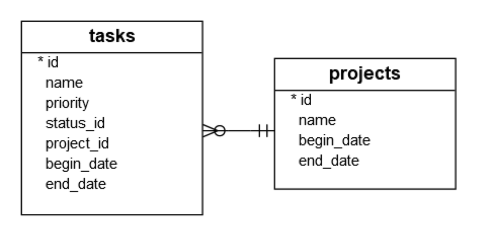

# 使用python建立sqlite建立資料表
- 使用connect()方法建立Connection物件
- 使用Connection的cursor()建立Cursor物件
- 使用CREATE TABLE語法和Cursor物件的execute()方法建立project和tasks2個資料表



## 建立projects資料表的SQL語法

```sql
CREATE TABLE IF NOT EXISTS projects(
		id integer PRIMARY KEY,
		name text NOT NULL,
		begin_date text,
		end_date text
);
```

## 建立tasks資料表的SQL語法

```sql
CREATE TABLE IF NOT EXISTS task(
	id integer PRIMARY KEY,
	name text NOT NULL,
	priority integer,
	project_id integer NOT NULL,
	status_id integer NOT NULL,
	end_date text NOT NULL,
	FOREIGN KEY(project_id) REFERENCES projects(id)
);
```


## 建立程式碼

```python
import sqlite3
from sqlite3 import Error

def create_connection(db_file):
    conn = None
    try:
        conn = sqlite3.connect(db_file)
    except Error as e:
        print(e)

    return conn

def create_table(conn):
    sql_projects = """
    CREATE TABLE IF NOT EXISTS projects(
		id INTEGER PRIMARY KEY,
		name TEXT NOT NULL,
		begin_date TEXT,
		end_date TEXT
    );
    """

    sql_tasks = """
    CREATE TABLE IF NOT EXISTS task(
		id INTEGER PRIMARY KEY,
		name TEXT NOT NULL,
		priority INTEGER,
		project_id INTEGER NOT NULL,
		status_id INTEGER NOT NULL,
		begin_date TEXT NOT NULL,
		end_date TEXT NOT NULL,
		FOREIGN KEY(project_id) REFERENCES projects(id)
    );
    """
    try:
        cursor = conn.cursor()
        cursor.execute(sql_projects)
        cursor.execute(sql_tasks)
    except Error as e:
        print(e)


if __name__ == "__main__":
    conn = create_connection('phtonsqlite.db')
    if conn is not None:
        create_table(conn)
        conn.close()
```


