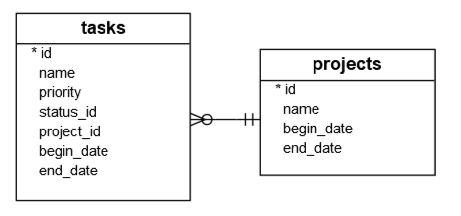

# 使用python選取資料
- 建立Connection物件
- 建立Cursor物件
- 使用SELECT語法選取資料
- 使用fetchall()方法取得資料



```python
import sqlite3
from sqlite3 import Error

def create_connection(db_file):
    conn = None
    try:
        conn = sqlite3.connect(db_file)
    except Error as e:
        print(e)

    return conn

def select_all_tasks(conn):

    sql = "SELECT * FROM task"
    cursor = conn.cursor()
    cursor.execute(sql)
    rows = cursor.fetchall()
    return rows

def select_task_by_priority(conn, priority):

    cursor = conn.cursor()
    sql = "SELECT * FROM task WHERE priority=?"
    cursor.execute(sql , (priority,))
    rows = cursor.fetchall()
    return rows

def select_all_using_subquery(conn,task_name):
    sql = """
    SELECT projects.name as projectName,
				projects.begin_date as projectBegin,
				projects.end_date as projectEnd,
				task.name as taskName				
                FROM task,projects
                WHERE projects.id = (
									SELECT project_id
									FROM task
									WHERE task.name = ?
                                    )
    """
    cursor = conn.cursor()
    cursor.execute(sql, (task_name,))
    rows = cursor.fetchall()
    return rows

def select_all_using_innerJoin(conn,task_name):
    sql = """
    SELECT projects.name as projectName,
				projects.begin_date as projectBegin,
				projects.end_date as projectEnd,
				task.name as taskName				
    FROM projects INNER JOIN task on projects.id = task.project_id
    WHERE task.name = ?
    """
    cursor = conn.cursor()
    cursor.execute(sql, (task_name,))
    rows = cursor.fetchall()
    return rows

if __name__ == "__main__":
    conn = create_connection('phtonsqlite.db')
    if conn is not None:
        with conn:
            rows1 = select_all_tasks(conn)
            rows2 = select_task_by_priority(conn,1)
            rows3 = select_all_using_subquery(conn,'我的任務1')
            rows4 = select_all_using_innerJoin(conn, '我的任務1')
            print(rows4)
```


