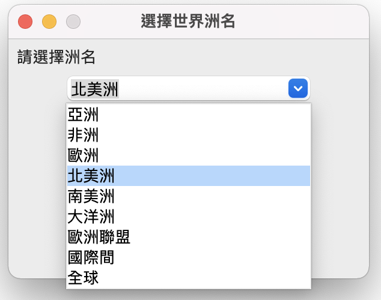

# 選擇洲名
1. 主程式 - lesson1.py
2. 資料庫操作 - source.py
3. 現成資料庫 - world.db



## lesson1.py

```python
import tkinter as tk
from tkinter import ttk
from tkinter.messagebox import showinfo
from source import *

window = tk.Tk()

# 修改視窗大小
window.geometry('300x200')
window.resizable(False, False)
window.title('選擇世界洲名')

# label顯示標題
label = ttk.Label(window,text="請選擇洲名")
label.pack(fill=tk.X, padx=5, pady=5)


# 建立下拉式表單
selected_continent = tk.StringVar()
selected_continent.set('請選擇')
combobox = ttk.Combobox(window, textvariable=selected_continent)
combobox.pack()

#提供資料
combobox['values'] = get_continent()

#預防使用者打字
combobox['state'] = 'readonly'

#使用者選擇的動作

def user_change(event):
    showinfo(
        title='結果',
        message=f'您的選擇:{selected_continent.get()}!'
    )
#綁定事件
combobox.bind('<<ComboboxSelected>>', user_change)


tk.mainloop()
```

## soruce.py

```python
import sqlite3
from sqlite3 import Error

def __create_connection(db_file):
    """
    建立資料庫和連線至資料庫
    :param db_file: 資料庫的檔案名稱
    :return: Connection物件
    """
    conn = None
    try:
        conn = sqlite3.connect(db_file)
        print(sqlite3.version)
    except Error as e:
        print(e)

    return conn


def __select_continent(conn):
    """
    選取world資料表
    :param conn:Connection物件
    :return:list
    """
    cursor = conn.cursor()
    sql = '''
    SELECT DISTINCT 洲名
    FROM world
    WHERE 洲名 IS NOT NULL
    '''
    cursor.execute(sql)
    rows = cursor.fetchall()
    continents = [row for row in rows if row is not None]
    return continents


def get_continent():
    database = "world.db"

    #建立資料庫和Connection物件
    conn = __create_connection(database)
    with conn:
        continents = __select_continent(conn)
        return continents
    return []


```