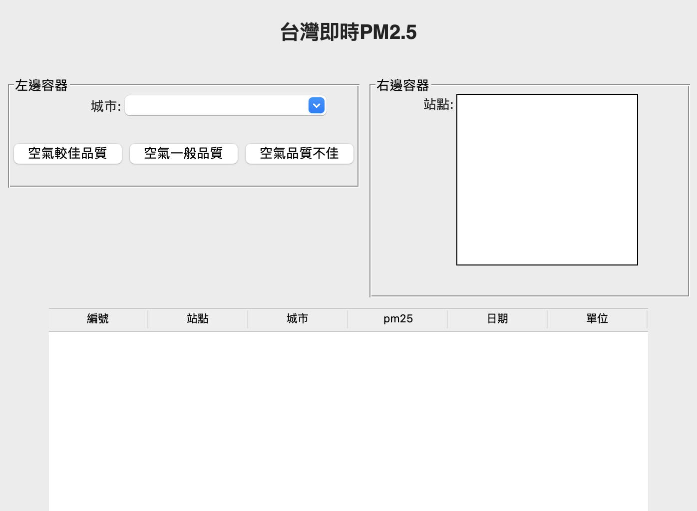

# 台灣即時pm2.5資訊
## 只收集最新一筆資料
### 第3部份建立介面



### 第3部份建立介面.py

```python
import tkinter as tk
from tkinter import ttk
from tkinter import font
import dataSource

class Window(tk.Tk):
    def __init__(self):
        super().__init__()
        # title_Font = font.nametofont('TkCaptionFont')
        # self.configure(background='white')
        title_Font = font.Font(family='Helvetica', size=20, weight='bold')
        titleLabel = ttk.Label(self, text="台灣即時PM2.5", font=title_Font, anchor=tk.CENTER)
        titleLabel.pack(fill=tk.X, pady=20)
        # 上方容器=============== start
        top_frame = tk.Frame(self)
        # 左邊容器==================start
        left_label_frame = tk.LabelFrame(top_frame, text="左邊容器")
        # 左上邊容器==================start
        left_top_frame = tk.Frame(left_label_frame)
        cityLabel = ttk.Label(left_top_frame, text="城市:")
        cityLabel.pack(side=tk.LEFT, padx=(50, 0))

        self.cityvar = tk.StringVar()
        city_combobox = ttk.Combobox(left_top_frame, textvariable=self.cityvar)
        city_combobox.pack()

        city_combobox.state(["readonly"])
        left_top_frame.pack()

        # 左上邊容器=================end

        # button_frame============start


        button_frame = tk.Frame(left_label_frame)
        betterButton = tk.Button(button_frame, text="空氣較佳品質")
        betterButton.pack(side=tk.LEFT)


        normalButton = tk.Button(button_frame, text="空氣一般品質")
        normalButton.pack(side=tk.LEFT)


        badButton = tk.Button(button_frame, text="空氣品質不佳")
        badButton.pack(side=tk.LEFT)
        button_frame.pack(pady=20)
        # button_frame============end

        left_label_frame.pack(side=tk.LEFT, anchor=tk.N, fill=tk.X, padx=(0, 10))
        # 左邊容器==================end


        # 右邊容器==================start
        right_label_frame = tk.LabelFrame(top_frame, text="右邊容器")
        siteLabel = ttk.Label(right_label_frame, text="站點:")
        siteLabel.pack(side=tk.LEFT, padx=(50, 0), anchor=tk.N)

        self.choicesvar = tk.StringVar(value=[])
        site_listbox = tk.Listbox(right_label_frame, height=10, listvariable=self.choicesvar)
        site_listbox.pack(side=tk.LEFT, padx=(0, 50), pady=(0, 30))
        right_label_frame.pack(side=tk.RIGHT, fill=tk.X)
        # 右邊容器==================end

        # 上方容器==================end
        top_frame.pack(padx=10, pady=10)

        # 下方容器===================start
        self.tree = ttk.Treeview(self, columns=('id', 'site', 'city', 'pm25', 'date', 'unit'), show='headings')
        self.tree.heading('id', text="編號")
        self.tree.heading('site', text="站點")
        self.tree.heading('city', text="城市")
        self.tree.heading('pm25', text="pm25")
        self.tree.heading('date', text="日期")
        self.tree.heading('unit', text="單位")
        self.tree.column('id', width=100)
        self.tree.column('site', width=100)
        self.tree.column('city', width=100)
        self.tree.column('pm25', width=100)
        self.tree.column('date', width=100)
        self.tree.column('unit', width=100)
        self.tree.pack(side=tk.TOP)
        # 下方容器===================end


if __name__ == "__main__":
    dataSource.download_save_to_DataBase()
    window = Window()
    window.title("PM2.5")
    window.mainloop()
    
```


### dataSource.py

```python
import requests
import sqlite3
from sqlite3 import Error


def __create_connection(db_file):
    conn = None
    try:
        conn = sqlite3.connect(db_file)
        print(sqlite3.version)
    except Error as e:
        print(e)
        return
    return conn


def __create_table_pm25(conn):
    sql = ''' 
    CREATE TABLE IF NOT EXISTS pm25 (
	id INTEGER PRIMARY KEY,
	站點 TEXT,
	城市 TEXT,
	pm25 REAL,
	日期 TEXT,
	單位 TEXT,
	UNIQUE(站點)
    );
    '''
    cursor = conn.cursor()
    cursor.execute(sql)
    #conn.commit()

def __replace_pm25(conn, values):
    """
    新增資料至projects資料庫
    :param conn:Connection物件
    :param project:tuple(加入至資料庫的內容)
    :return:自動建立id的最後一筆
    """
    sql = ''' 
    REPLACE INTO pm25 (站點,城市,pm25,日期,單位)
    VALUES (?,?,?,?,?)
    '''
    cursor = conn.cursor()
    cursor.execute(sql, values)
    conn.commit()

def __downloadData():
    urlpath = '	https://data.epa.gov.tw/api/v1/aqx_p_02?limit=1000&api_key=9be7b239-557b-4c10-9775-78cadfc555e9&sort=ImportDate%20desc&format=json'
    def stringToFloat(s):
        try:
            return float(s)
        except:
            return 999.0
    response = requests.get(urlpath)
    if response.status_code == 200:
        print('下載成功')
        data = response.json()
        datas = data["records"]
        importData = [
            (item['Site'], item['county'], stringToFloat(item['PM25']), item['DataCreationDate'], item['ItemUnit']) for
            item in datas]
        return importData

def __saveToDataBase(datas):
    '''
    儲存資料至資料庫db25
    :param datas: list->tuple
    :return:
    '''
    conn = __create_connection('pm25.db')
    print("資料庫連線成功")
    with conn:
        __create_table_pm25(conn) #建立資料表
        for value in datas:
            __replace_pm25(conn, value) #插入資料

def download_save_to_DataBase():
    importData = __downloadData() #下載資訊
    __saveToDataBase(importData) #儲存資料至資料庫
```


