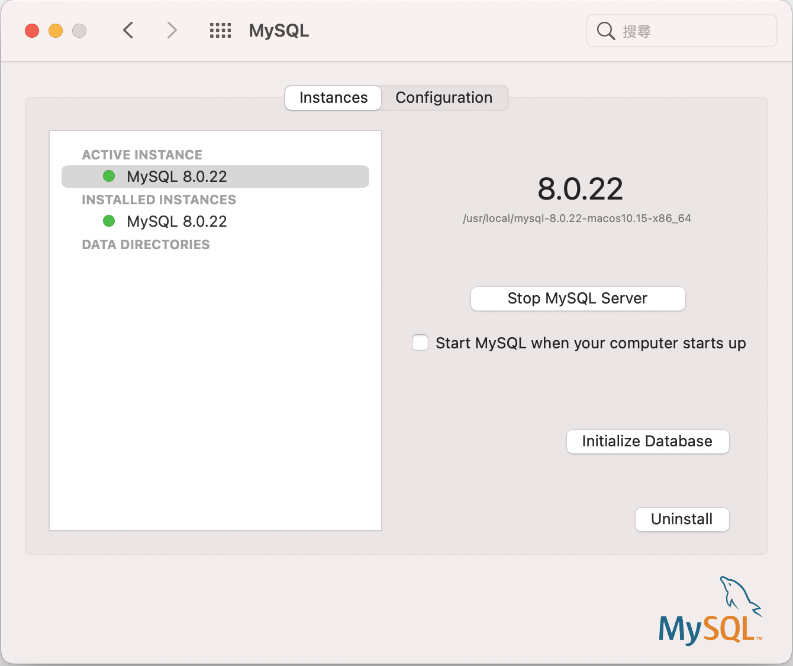

# 安裝mySQL
## mac上安裝mySQL
- [官網下載mySQL](https://dev.mysql.com/downloads/file/?id=499568), 使用下面連結下載`No thanks, just start my download.`


- 執行dmg檔,再執行pkg檔
- 使用傳統密碼加密


- 安裝完成後至 `系統偏號設定>MySQL` 點選MySQL


- 在終端機介面執行 `nano ~/.zshrc`
- 在檔案最下方新增`export PATH="/usr/local/mysql/bin:$PATH"`
- 儲存後回到終端機
- 在終端機介面執行 `source ~/.zshrc`
- 在終端機下執行 `mysql -u root -p`
- 輸入root的密碼


## 下載mac版 MySQL Connector/Python
- [官網下載connect/python](https://dev.mysql.com/downloads/file/?id=498635),使用下面連結下載`No thanks, just start my download.`
- 執行dmg檔,再執行pkg檔

## mac安裝mySQL管理軟體Sequel Pro

## 使用pip下載 Connector/Python

```
#下載
$ sudo pip install --upgrade pip
$ pip install mysql-connector-python

#移除
$ pip uninstall mysql-connector-python
```

查看是否安裝成功

```
$ pip freeze

結果:===========================

mysql-connector-python==8.0.22

```

使用python程式驗証是否成功

```python
import mysql.connector
print(
  "MySQL Connector/Python version: {0}".format(mysql.connector.__version__)
)

結果:==================================
MySQL Connector/Python version: 8.0.22
```

```python
#verifying
import mysql.connector
print(
  "MySQL Connector/Python version: {0}"
  .format(mysql.connector.__version__)
)
print("Version as tuple:")
print(mysql.connector.__version_info__)
print("")
print("API level: {0}".format(mysql.connector.apilevel))
print("Parameter style: {0}".format(mysql.connector.paramstyle))
print("Thread safe: {0}".format(mysql.connector.threadsafety))

結果:===========================================
MySQL Connector/Python version: 8.0.22
Version as tuple:
(8, 0, 22, '', 1)

API level: 2.0
Parameter style: pyformat
Thread safe: 1

```

## 增加應用程式使用者,[官方說明](https://dev.mysql.com/doc/refman/en/security.html)

```
#建立一個使用者,後面的password必需使用密碼

mysql > CREATE USER 'pyuser'@'127.0.0.1' IDENTIFIED BY 'password';

#pyuser可以對world.sql有全部權限
mysql > GRANT ALL PRIVILEGES ON world.* TO 'pyuser'@'127.0.0.1' WITH GRANT OPTION;

#pyuser可以對py_test_db.sql有全部權限
# GRANT ALL PRIVILEGES ON py_test_db.* TO 'pyuser'@'127.0.0.1' WITH GRANT OPTION;

```


## 下載sample檔
-[官網下載 word.zip](https://dev.mysql.com/doc/index-other.html)

## 進入到world.sql的目錄，使用pyuser登入

```
$ mysql --user=pyuser --password --host=127.0.0.1
Enter password:輸入您的密碼

mysql> source world.sql
mysql> SHOW TABLES FROM world;
結果:=================
+-----------------+
| Tables_in_world |
+-----------------+
| city            |
| country         |
| countrylanguage |
+-----------------+
3 rows in set (0.00 sec)

mysql> SHOW CREATE TABLE world.city\G
結果:===================================
*************************** 1. row ***************************
       Table: city
Create Table: CREATE TABLE `city` (
  `ID` int NOT NULL AUTO_INCREMENT,
  `Name` char(35) NOT NULL DEFAULT '',
  `CountryCode` char(3) NOT NULL DEFAULT '',
  `District` char(20) NOT NULL DEFAULT '',
  `Population` int NOT NULL DEFAULT '0',
  PRIMARY KEY (`ID`),
  KEY `CountryCode` (`CountryCode`),
  CONSTRAINT `city_ibfk_1` FOREIGN KEY (`CountryCode`) REFERENCES `country` (`Code`)
) ENGINE=InnoDB AUTO_INCREMENT=4080 DEFAULT CHARSET=utf8mb4 COLLATE=utf8mb4_0900_ai_ci
1 row in set (0.00 sec)

mysql> SELECT COUNT(*) FROM world.city;
結果:=================================
+----------+
| count(*) |
+----------+
|     4079 |
+----------+
1 row in set (0.01 sec)


mysql > SHOW CREATE TABLE world.country\G
結果:==========================
*************************** 1. row ***************************
       Table: country
Create Table: CREATE TABLE `country` (
  `Code` char(3) NOT NULL DEFAULT '',
  `Name` char(52) NOT NULL DEFAULT '',
  `Continent` enum('Asia','Europe','North America','Africa','Oceania','Antarctica','South America') NOT NULL DEFAULT 'Asia',
  `Region` char(26) NOT NULL DEFAULT '',
  `SurfaceArea` decimal(10,2) NOT NULL DEFAULT '0.00',
  `IndepYear` smallint DEFAULT NULL,
  `Population` int NOT NULL DEFAULT '0',
  `LifeExpectancy` decimal(3,1) DEFAULT NULL,
  `GNP` decimal(10,2) DEFAULT NULL,
  `GNPOld` decimal(10,2) DEFAULT NULL,
  `LocalName` char(45) NOT NULL DEFAULT '',
  `GovernmentForm` char(45) NOT NULL DEFAULT '',
  `HeadOfState` char(60) DEFAULT NULL,
  `Capital` int DEFAULT NULL,
  `Code2` char(2) NOT NULL DEFAULT '',
  PRIMARY KEY (`Code`)
) ENGINE=InnoDB DEFAULT CHARSET=utf8mb4 COLLATE=utf8mb4_0900_ai_ci

mysql > SELECT COUNT(*) FROM world.country;
結果:========================
+----------+
| COUNT(*) |
+----------+
|      239 |
+----------+
1 row in set (0.00 sec)

mysql > SHOW CREATE TABLE world.countrylanguage\G
結果:===============================
*************************** 1. row ***************************
       Table: countrylanguage
Create Table: CREATE TABLE `countrylanguage` (
  `CountryCode` char(3) NOT NULL DEFAULT '',
  `Language` char(30) NOT NULL DEFAULT '',
  `IsOfficial` enum('T','F') NOT NULL DEFAULT 'F',
  `Percentage` decimal(4,1) NOT NULL DEFAULT '0.0',
  PRIMARY KEY (`CountryCode`,`Language`),
  KEY `CountryCode` (`CountryCode`),
  CONSTRAINT `countryLanguage_ibfk_1` FOREIGN KEY (`CountryCode`) REFERENCES `country` (`Code`)
) ENGINE=InnoDB DEFAULT CHARSET=utf8mb4 COLLATE=utf8mb4_0900_ai_ci

mysql > SELECT COUNT(*) FROM world.countrylanguage;
結果:=================================
+----------+
| COUNT(*) |
+----------+
|      984 |
+----------+
1 row in set (0.00 sec)

```

## 使用python連線

```pythoon
import mysql.connector

connect_args = {
  "host": "127.0.0.1",
  "port": 3306,
  "user": "pyuser",
  "password": "raspberry",
}

# ---- connect() function ----

db1 = mysql.connector.connect(
  **connect_args
)

print(
  "MySQL connection ID for db1: {0}"
  .format(db1.connection_id)
)

db1.close()

結果:=============================
MySQL connection ID for db1: 21

```